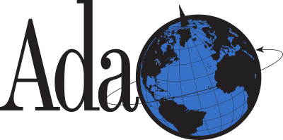

# Ada Planet 3.0
### News from the Ada programming language world
This is the third incarnation Ada Planet a site collecting RSS and Atom feeds for news about the Ada programming language.
The previous version by Thindil, which was the second incarnation, is archived in his [repository](https://github.com/thindil/adaplanet).

The current version is simply powered by Blogger. This repository is just a backup of the site theme, containing both the structure and the feeds of the site.
The way to include a new feed is via the Blogger web interface, so do not send a pull request modifying the XML file. You can propose new feeds just by creating
an [issue](https://github.com/mgrojo/ada-planet/issues) or writing on [this blog post](https://ada-planet.blogspot.com/2024/03/welcome.html#comment-form).
